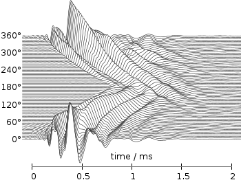
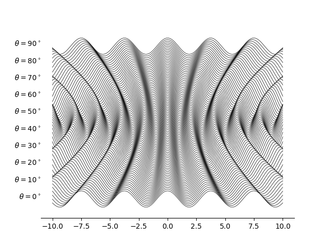
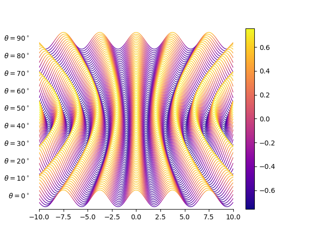

# Matplotlib-based waterfall plot

This repo contains some code to generate Mathematica-like quasi 3D waterfall plot using python and matplotlib. The goal was to create something resembling the image below:

This kind of method can be used if one has datasets that are relatively dense in two dimensions versus a third dimension, that is to say, the number of data-points on the x and y axis Nx, Ny are much larger than those in the z axis. An example of such data could be if you measure the some parameter y(x, z), over x, z-times, where z could for instance represent an angle at which this measurement is being taken. A concrete example for which I had such data was measuring some voltage U (y), dependent on a magnetic field strength B (x) with thousands of data-points, and the measurement was repeated for varying angles of incidence of the magnetic field \(\theta\) (z) with \(2^\circ\) steps.

The basic way to create such an image is to shift each set of y-data by some z-dependent amount, such that the y and z axes are effectively blended. This destroys the meaning of the true y-value represented in the plot, but that can be fixed by using a color-mapping, which will be discussed later. For this reason, we do show a y-axis as the value on there would be meaningless.

The file `waterfall_2d.py` contains code to create a similar to the goal image shown above, it produces the image below:

As you can see, it looks like we're looking top down onto the data and we can clearly see "ripples" in the data that depend on the "angle" (note that this is just some interesting looking dummy data). 

If the only important thing is the shape of these ripples, a plot like this is fine. But if we are interested in what the actual height of the ripples in the plot are, we may use a colormapping that is normalized over the absolute maximum and minimum of all y-data sets. The file `waterfall_2d_cmap.py` generates the image below:

